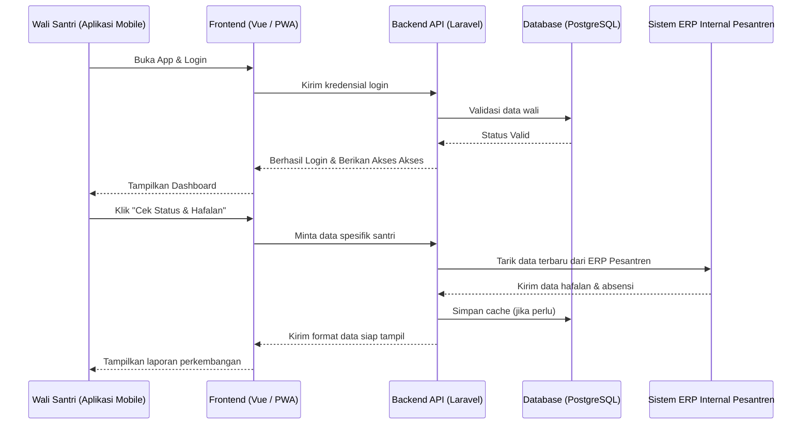
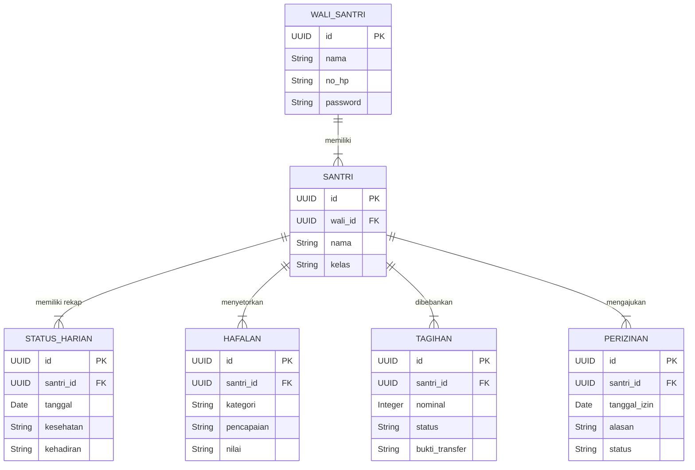

# PRD — Project Requirements Document

## 1. Overview
Orang tua atau wali santri sering kali merasa khawatir dan kesulitan mendapatkan informasi terkini terkait perkembangan putra-putrinya selama berada di pondok pesantren. Mulai dari masalah kesehatan, kelancaran hafalan, hingga administrasi seperti tagihan dan proses perizinan yang masih manual. 

**Asy-Syifaa App** adalah aplikasi mobile resmi untuk orang tua dan wali santri Pondok Pesantren Asy-Syifaa Wal Mahmuudiyyah. Tujuan utama aplikasi ini adalah memberikan transparansi penuh serta mempermudah segala urusan administratif. Dengan aplikasi ini, orang tua dapat memantau aktivitas harian, perkembangan hafalan, membayar tagihan, hingga mengajukan izin anak langsung dari rumah (di genggaman tangan) dengan mudah dan aman.

## 2. Requirements
- **Target Pengguna:** Orang tua dan wali santri Pondok Pesantren Asy-Syifaa Wal Mahmuudiyyah.
- **Platform:** Aplikasi Mobile Android (Dibangun menggunakan teknologi web PWA dan didistribusikan ke Google Play Store melalui metode TWA agar terlihat seperti aplikasi asli/native).
- **Keamanan Data:** Sistem harus terhubung secara langsung dan aman dengan sistem internal (ERP) Pondok Pesantren. Wali santri hanya bisa melihat data milik putra-putrinya sendiri.
- **Kenyamanan Pengguna (UX):** Antarmuka harus sangat mudah digunakan (user-friendly) agar orang tua dari berbagai kalangan usia dapat mengakses informasi tanpa kebingungan.

## 3. Core Features
- **Pengecekan Status Harian (Kehadiran & Kesehatan) — *First Win***: Orang tua bisa langsung melihat apakah anak mereka hadir berkegiatan dan bagaimana status kesehatannya hari ini.
- **Pantauan Progress Hafalan**: Menampilkan secara *real-time* perkembangan hafalan Al-Qur'an, Hadist, dan Ilmu santri, lengkap dengan pencapaian per juz dan nilai setoran.
- **Manajemen Tagihan & Pembayaran**: Kemudahan untuk mengecek biaya syahriyah (bulanan) atau biaya lain, serta fitur mengunggah bukti transfer langsung dari aplikasi tanpa perlu antri atau menghubungi admin kampus.
- **Pengajuan Izin Online**: Fasilitas untuk mengajukan izin keluar, pulang, atau kegiatan lainnya secara digital dengan pantauan status persetujuan (disetujui/ditolak) secara langsung.
- **Pusat Informasi & Notifikasi**: Mendorong pengguna untuk terus kembali ke aplikasi melalui *push notifications* untuk info santri tiba, tagihan, pengumuman resmi pesantren, serta galeri foto kegiatan terbaru.

## 4. User Flow
1. **Login & Autentikasi:** Wali santri mengunduh aplikasi dari Play Store, lalu login menggunakan akun yang sudah diverifikasi dan dihubungkan dengan data santri oleh admin pesantren.
2. **Dashboard Utama:** Saat aplikasi terbuka, wali santri langsung melihat "Status Harian" anak (sehat/sakit, hadir/absen) dan informasi tagihan terbaru.
3. **Mengeksplorasi Progres:** Wali santri menekan menu "Hafalan" untuk melihat detail setoran terakhir anak hari itu.
4. **Melakukan Pembayaran:** Jika ada tagihan, wali santri menekan menu "Tagihan", melihat detail biaya, mentransfer via bank, lalu mengunggah foto bukti transfer di halaman tersebut.
5. **Mengajukan Izin:** Saat butuh menjemput anak, wali menekan menu "Izin", mengisi tanggal dan alasan, lalu menekan kirim. Wali akan menerima notifikasi saat izin disetujui ustaz/pengurus.
6. **Menerima Update:** Wali mendapat notifikasi *pop-up* di HP terkait pengumuman libur pesantren atau melihat foto baru di Galeri Kegiatan.

## 5. Architecture
Aplikasi berjalan di HP pengguna (Frontend) yang akan meminta dan mengirim data ke server pusat (Backend). Server pusat ini bertugas menyimpan data dan menyinkronkannya dengan sistem internal pesantren.

## 6. Database Schema
Berikut adalah gambaran tabel database untuk mendukung aplikasi ini. Data inti kemungkinan disinkronkan dengan ERP pesantren.

### Entitas Tabel:
- **Tabel Wali_Santri**: Menyimpan data login orang tua.
  - `id` (UUID): ID unik wali.
  - `nama` (String): Nama lengkap wali.
  - `no_hp` (String): Nomor telepon untuk login/kontak.
  - `password` (String): Kata sandi terenkripsi.
- **Tabel Santri**: Menyimpan data murid.
  - `id` (UUID): ID unik santri.
  - `wali_id` (UUID): Relasi ke tabel Wali.
  - `nama` (String): Nama santri.
  - `kelas` (String): Tingkat/kelas santri.
- **Tabel Status_Harian**: Menyimpan absensi dan kesehatan.
  - `id` (UUID): ID unik status.
  - `santri_id` (UUID): Relasi ke tabel Santri.
  - `tanggal` (Date): Tanggal pencatatan.
  - `kesehatan` (String): Kondisi (contoh: Sehat, Sakit).
  - `kehadiran` (String): Status hadir/absen.
- **Tabel Hafalan**: Menyimpan riwayat setoran hafalan.
  - `id` (UUID): ID unik hafalan.
  - `santri_id` (UUID): Relasi ke tabel Santri.
  - `kategori` (String): Qur'an, Hadist, dll.
  - `pencapaian` (String): Juz/halaman/bab yang disetor.
  - `nilai` (String): Penilaian dari ustadz.
- **Tabel Tagihan**: Menyimpan data biaya dan pembayaran.
  - `id` (UUID): ID unik tagihan.
  - `santri_id` (UUID): Relasi ke tabel Santri.
  - `nominal` (Integer): Jumlah tagihan.
  - `keterangan` (String): Jenis tagihan (Syahriyah, Buku, dll).
  - `status` (String): Belum Dibayar, Menunggu Konfirmasi, Lunas.
  - `bukti_transfer` (String): Link/URL gambar bukti bayar.
- **Tabel Perizinan**: Menyimpan pengajuan izin.
  - `id` (UUID): ID unik izin.
  - `santri_id` (UUID): Relasi ke tabel Santri.
  - `tanggal_izin` (Date): Mulai izin.
  - `alasan` (Text): Alasan perizinan.
  - `status` (String): Menunggu, Disetujui, Ditolak.

### Diagram Relasi Database (ERD):

## 7. Tech Stack
Teknologi yang digunakan dipilih untuk memastikan performa yang cepat, kemudahan dalam rilis ke Play Store, serta integrasi manajemen data yang kuat.

- **Frontend (Aplikasi Mobile):** **Vue.js** 
  *(Akan dikonfigurasi sebagai PWA - Progressive Web App, kemudian dibungkus menggunakan TWA - Trusted Web Activity agar dapat diunggah dan diunduh langsung melalui Google Play Store).*
- **Backend (API & Server Logic):** **Laravel** (PHP framework)
  *(Sangat mumpuni dalam mengelola sistem administrasi yang kompleks serta menyediakan API yang aman untuk dikonsumsi oleh aplikasi mobile).*
- **Database:** **PostgreSQL**
  *(Database relasional yang kuat, aman, dan sangat handal untuk menyimpan pencatatan keuangan dan data siswa dalam jumlah besar).*
- **Deployment & Hosting:** **VPS (Virtual Private Server)**
  *(Memberikan kontrol penuh atas server untuk menjamin keamanan data dan kestabilan komunikasi dengan ERP Internal pesantren).*